.. _link: https://github.com/ncherric/Iliad
.. _snakemake: https://snakemake.readthedocs.io

.. _getting_started/demo:

====
DEMO
====
########################

The purpose of the DEMO is to take you step-by-step in retrieving the *Iliad* suite of workflows and running the Main Module using tutorial data.

Cloning the GitHub Repo
=======================

* Step 1. Open up your web browser and follow this link_ to *Iliad* GitHub repository. You can read the README for general info and copy the HTTPS link. Here is the `HTTPS link <https://www.github.com/ncherric/Iliad.git>`_  to save you some web browsing.

|
|

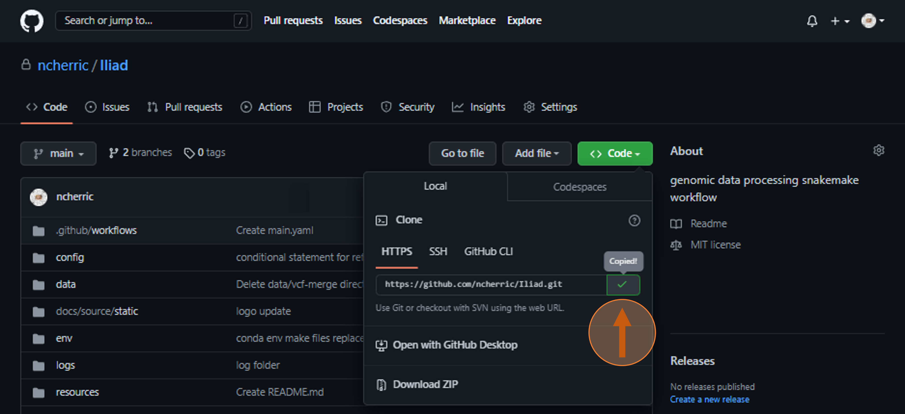

.. toctree::
   :maxdepth: 2

|
|

* Step 2. run ``git clone https://www.github.com/ncherric/Iliad.git`` in order to retrieve the workflows and configuration files.

|
|

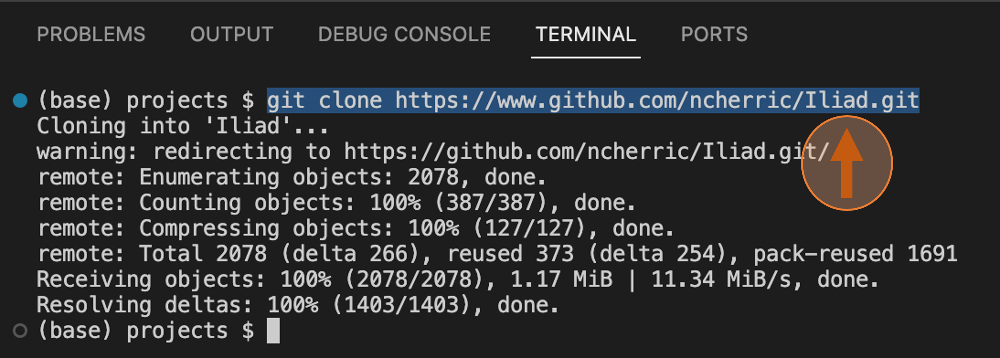

.. toctree::
   :maxdepth: 2

|
|

* Step 3. Now make sure you are in the right environment. If you see ``(base) Iliad $`` you are not in the right environment. Create the mamba or conda environment using either mamba or conda. We use mamba here because it is an updated python package manager version of conda, but conda should work interchangeably and we have tested this.

|
|

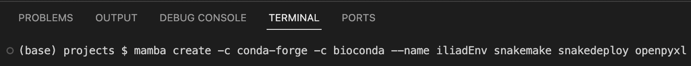

.. toctree::
   :maxdepth: 2

|
|

* Step 4.

|
|

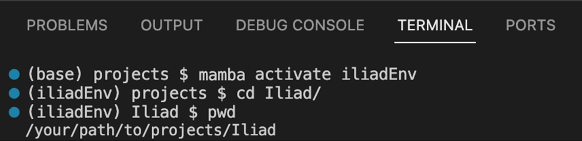

.. toctree::
   :maxdepth: 2

|
|

* Step 5.

|
|

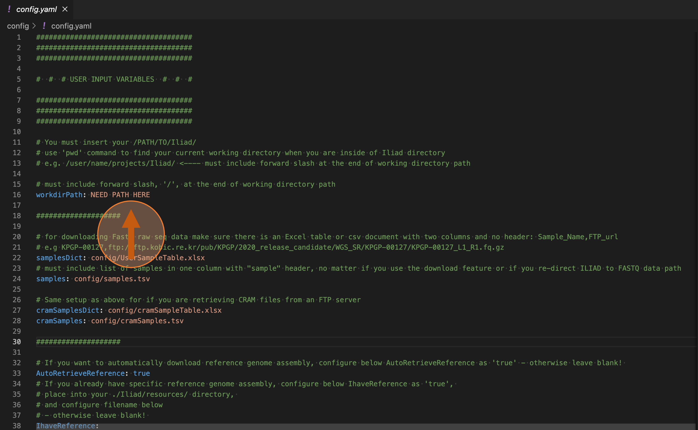

.. toctree::
   :maxdepth: 2

|
|

* Step 6.

|
|

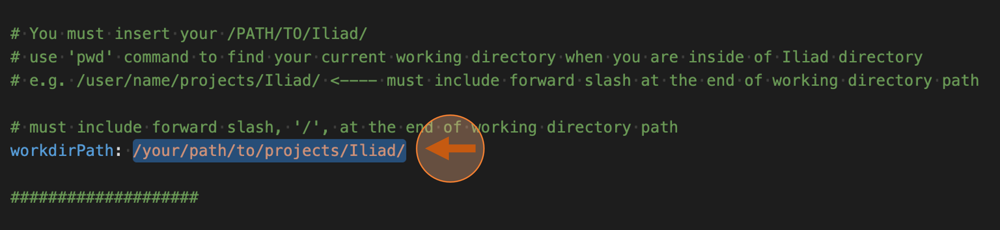

.. toctree::
   :maxdepth: 2

|
|

* Step 7.

|
|

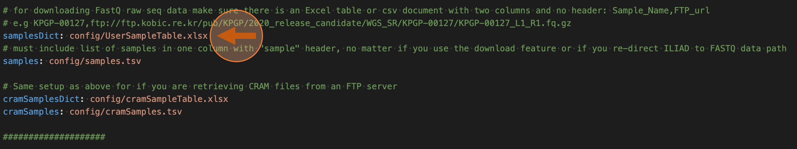

.. toctree::
   :maxdepth: 2

|
|

The table will have two columns - Column 1 you input the sample ID. It is ok to have multiple repeating Sample IDs for paired-end reads and multiplexed data. Here is the tutorial file already setup: ``./Iliad/config/UserSampleTable.csv``

|
|

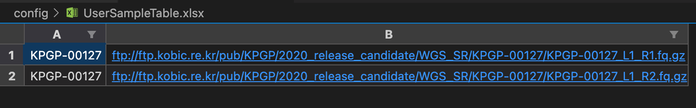

.. toctree::
   :maxdepth: 2

|
|

* Step 8.

|
|

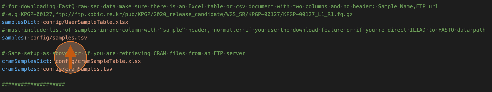

.. toctree::
   :maxdepth: 2

|
|

It also requires you put each sample ID in a list into a text file ``./Iliad/config/samples.tsv``. One sample per line. DO NOT repeat sample IDs here.

|
|

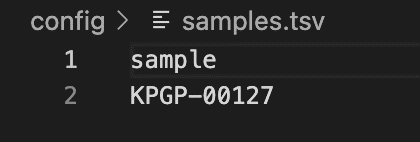

.. toctree::
   :maxdepth: 2

|
|

* Step 9. Run a dry run (-n) and print statements (p) -> so ``snakemake -np``. In some cases you may need to add other flags like ``--rerun-incomplete`` or ``ignore-incomplete`` or ``rerun-triggers mtime``. See the Snakemake_ documentation for appropriate usage.

|
|

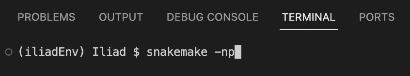

.. toctree::
   :maxdepth: 2

|
|

Below is the stdout from running  ``snakemake -np``.

|
|

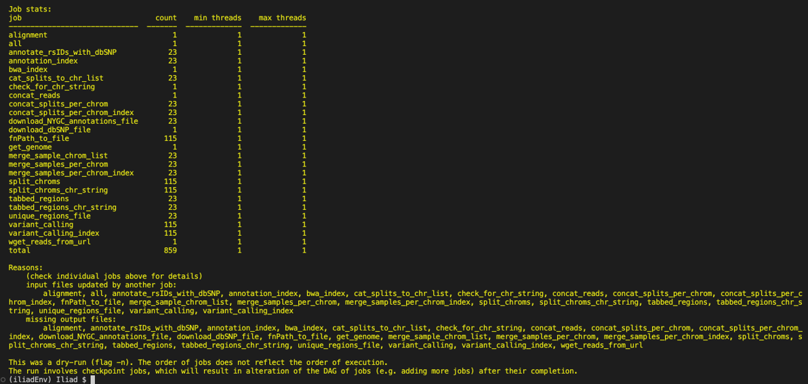

.. toctree::
   :maxdepth: 2

|
|

* Step 10.

|
|

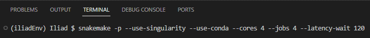

.. toctree::
   :maxdepth: 2

|
|

* Step 11. In summary, these paired-end reads were downloaded from the open source ftp site by providing the link in this ``UserSampleTable.xlsx``. This will be the input to *Iliad*. You will have to edit this file with links to automatically download the data for your needs. For this tutorial, keep the file as is.

|
|

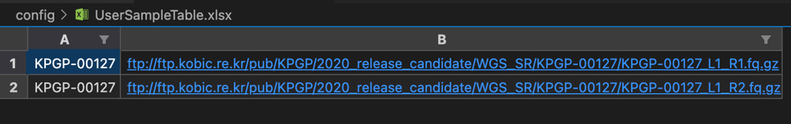

.. toctree::
   :maxdepth: 2

|
|

This is the output from *Iliad*. I use the ``tree`` command here just to demonstrate the file structures of the output. It will be output in ``./Iliad/results/`` directory. There you will find directories created for specific stages of output - FASTQ, sorted BAM, and VCF. 

|
|

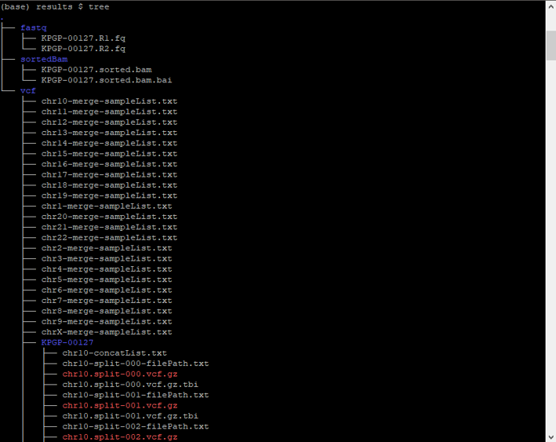

.. toctree::
   :maxdepth: 2

|
|

Using Snakedeploy from snakemake workflow catalog
=================================================

**! Under Construction !**