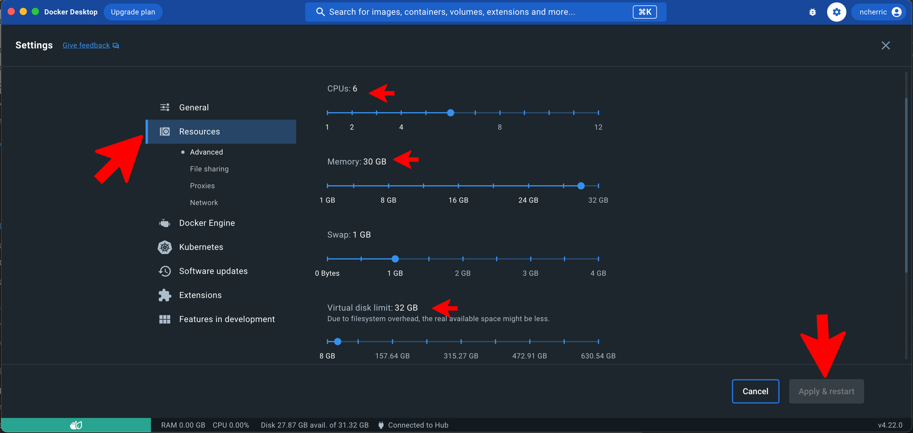

.. _Miniconda: https://conda.pydata.org/miniconda.html
.. _Mambaforge: https://github.com/conda-forge/miniforge#mambaforge
.. _Mamba: https://github.com/mamba-org/mamba
.. _Conda: https://conda.pydata.org
.. _instructions: https://mamba.readthedocs.io/en/latest/installation.html
.. _platform: https://iliad-readthedocs.readthedocs.io/en/latest/getting_started/platform_preparation.html
.. _token: https://docs.github.com/en/get-started/getting-started-with-git/about-remote-repositories#cloning-with-https-urls
.. _creation: https://docs.github.com/en/authentication/keeping-your-account-and-data-secure/managing-your-personal-access-tokens#creating-a-fine-grained-personal-access-token
.. _homepage: https://cloud.google.com/?hl=en

.. _getting_started/docker:

=======================
Local machine - Docker
=======================

First, it is important to know the machine specs on your local device i.e., Disk Space (Storage) and RAM (Memory).
To work with human genomics and this tutorial, it will be necessary to have atleast 500 GB of free Disk Space and 30 GB of RAM. 
For this How-To guide, I use an external SSD storage drive. 

Next, follow along this video when creating your Docker container from Iliad's Docker Image. This tutorial was performed on MacOS.

.. raw:: html
    
   <iframe width="560" height="315" src="https://www.youtube.com/embed/XaovbZCDtm4" title="YouTube video player" frameborder="0" allow="accelerometer; autoplay; clipboard-write; encrypted-media; gyroscope; picture-in-picture; web-share" allowfullscreen></iframe>

Docker Install and Run

Step 1: Download, Install, and Configure Docker Desktop
*******************************************

Follow instructions here to download and install Docker Desktop: https://www.docker.com/products/docker-desktop/
This website will recognize what your machine is. Remember this for Step 2.

Edit Resource Settings in the Docker Desktop like so:

Find Settings

Find Resources and adjust CPUs (6-12), Memory (30 GB), and Virtual disk limit (~32 GB). These will depend on your system's available specs and other uses you have for Docker.
These suggestions are based on Iliad and this tutorial.

Step 2: Pull image from Docker
******************************

Make sure have the right system architecture for your machine.

I have the **INTEL CHIP** - x86_64

.. code-block:: console

    $ docker pull ncherric/iliad:x86_64-v1.16

If you have the new **APPLE M1 CHIP** - aarch / arm64

.. code-block:: console

    $ docker pull ncherric/iliad:arm64-v1.16

Step 3: Run the Docker image 
****************************

This creates a container based on the Iliad Docker Image that you can enter and exit. (Change the image to iliad:arm64-v1.16 if you have Apple M1 chip)

.. code-block:: console

    $ docker run -it -v /Volumes:/External_SSD ncherric/iliad:x86_64-v1.16 --name iliadHOWTO

If you ever ``exit`` your container, you can re-enter with ``docker exec -it iliadHOWTO bash``.
Replace `iliadHOWTO` with <container_name> if you have declared a different container name.

Step 4: Clone the Iliad repository and workflows
************************************************

In the next step, you will clone the Iliad repo. This will create an Iliad directory that you will cd into.
If you are not an active github user, you may have to create an account and a personal access token that is entered 
for password when prompted to do so on the command line in the following step. 
Here is a link for token_ information and creation_.

**Clone the repository using git:**

.. code-block:: console
    $ cd External_SSD
    $ git clone https://github.com/ncherric/Iliad.git
    $ cd Iliad

Now, there should be an ``./Iliad`` directory cloned into your ``/path/to/project/`` like such ``/path/to/project/Iliad/``.
And your current working directory should be ``/path/to/project/Iliad/``.

Two important folders found in the Iliad directory are **workflow** and **config**.
The ``workflow`` contains rules and scripts that a designated Snakefile in Iliad call on to run a specific module.
The ``config`` contains one configuration file ``Iliad/config/config.yaml`` which will be modified in the next step in order to configure the workflow to your needs.
It also contains ``Excel`` or ``CSV`` for sampleID and URL as well as ``TSV`` files where you will input your sample ID only in one column.

Since we are on a local machine and have mounted the volume **External_SSD** with our docker ``-v`` option, we can visualize this directory 
and its contents with the Finder app on MacOS.

Step 5: Configure Workflow
**************************

There are 2 methods: Automatic and Manual 

**A) Automatic**

.. code-block:: console

    $ cd config
    $ python auto_config.py
    # Now you will see interactive prompts. If you want to follow default and tutorial, here are your options that you should copy and paste, individually when prompted.
    /usr/projects/Iliad/
    config/UserSampleTable.csv
    homo_sapiens
    104
    GRCh38
    $ mv modified.yaml config.yaml
    $ cd ..

There will be interactive questions on the command line that will ask you to enter your 1) working directory 2) sample table file with download URLs and 3) reference assembly info for download. 
Answer the interactive prompts accordingly and then press RETURN/ENTER.
**NOTE**: Using this command-line interactive prompt to update the config.yaml file will erase all comments and notes in your ``config.yaml`` file. 
There is an additional ``config-commented.yaml`` that you can refer to if you have questions about settings.

**B) Manual**

To configure this workflow, modify ``Iliad/config/config.yaml`` according to your needs. 
The file is clearly denoted into sections that you can change according to your needs. 
There are many defaults set that you do not have to change. The one most important change you will have to make is the following:

.. code-block:: console

    $ nano config/config.yaml

And INSERT your working directory path where NEED PATH HERE is. should look like this: **/path/to/project/Iliad/** or in this HOW-TO specifically **/External_SSD/Iliad/**

.. code-block:: yaml

    #####################################
    #####################################
    #####################################

    #  #  # USER INPUT VARIABLES  #  #  #

    #####################################
    #####################################
    #####################################

    # You must insert your /PATH/TO/Iliad/
    # use 'pwd' command to find your current working directory when you are inside of Iliad directory
    # e.g. /path/to/Iliad/ <---- must include forward slash at the end of working directory path

    # must include forward slash, '/', at the end of working directory path
    workdirPath: NEED PATH HERE

Step 6: Run workflow
********************

Given that the workflow has been properly deployed and configured, and your conda environment is activated, it can be executed as follows.

For running the workflow while deploying any necessary software via singularity and conda (using the Mamba package manager by default), run Snakemake with

.. code-block:: console

    $ snakemake -p --use-conda --cores 1 --jobs 1 --default-resource=mem_mb=10000 --latency-wait 120

Other workflows
********************

When executing the workflow, Snakemake will automatically find the main Snakefile in the workflow subfolder which is the **Raw Sequence Read Data** module.
However, there are other Snakefiles that are specific to the other Modules that you will have to call using ``--snakefile [desired module snakefile]``

* ``--snakefile workflow/Snakefile`` -> Raw Sequence Read Data
* ``--snakefile workflow/cram_Snakefile`` -> Stored Sequence Read Data
* ``--snakefile workflow/snpArray_Snakefile`` -> SNP Array Data
* ``--snakefile workflow/LiftoverTo38_Snakefile`` -> Submodule to liftover GRCh37 assembly VCF data to GRCh38 assembly
* ``--snakefile workflow/LiftoverTo37_Snakefile`` -> Submodule to liftover GRCh38 assembly VCF data to GRCh37 assembly
* ``--snakefile workflow/merger_Snakefile`` -> Submodule to merging list of VCFs
* ``--snakefile workflow/mergeRefTarget_Snakefile`` -> Submodule that will merge your processed Reference and Target data if you have previously completed both modules 

Visit the How-To Guides pages for further info about each of the Modules and Submodules in the bulleted list above.

This example bewlow is for the `Stored Sequence Read Data <https://iliad-readthedocs.readthedocs.io/en/latest/tutorial/stored_sequence.html>`_

.. code-block:: console

    $ snakemake -p --use-conda --cores 1 --jobs 1 --snakefile workflow/cram_Snakefile --default-resource=mem_mb=10000 --latency-wait 120
