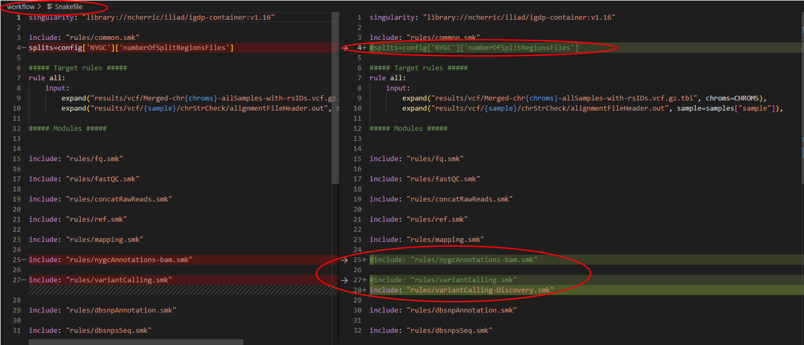
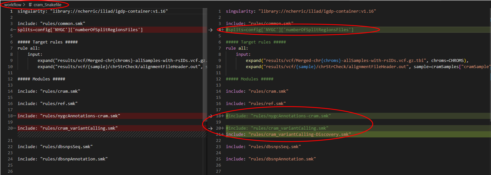

.. _projectinfo/comingsoon:

===========
Coming Soon
===========

Sequence Read Archive retrieval
===============================

This feature will give users an option to automatically perform data downloads using the SRAtoolkit and access data from the NCBI Sequence Read Archive (SRA).

CRAM remapping
==============

Genomic data is commonly stored in CRAM format. Of course, these data files have already been mapped to a reference genome. 
To our knowledge, there is not a direct option for remapping a CRAM file, however, reverting a CRAM sample to a FASTQ or FASTA file is possible via samtools. 
This feature will include that step and steps thereafter for re-alignment to a reference genome of the user's choice. 

Variant discovery
=================
    
The current format of Iliad Sequence processing entails the use of variant genotyping using annotation files from the NYGC. We understand the importance of variant discovery 
and aim to streamline this option in a future release. Currently, you can manually (and quite easily) set this up by commenting out three lines of code and adding one new line
of code to ``./Iliad/workflow/Snakefile`` (for raw sequence reads) or ``./Iliad/workflow/cram_Snakefile`` (for cram sequence data) while we develop this method further. 
See the code blocks and images below to manually perform this.

**Raw sequence reads**

Raw sequence reads - file found in ``./Iliad/workflow/Snakefile``

You can delete the contents of ``./Iliad/workflow/Snakefile`` and copy/paste below to replace it:

.. code-block:: console

    singularity: "library://ncherric/iliad/igdp-container:v1.16"

    include: "rules/common.smk"
    #splits=config['NYGC']['numberOfSplitRegionsFiles']

    ##### Target rules #####
    rule all:
        input: 
            expand("results/vcf/Merged-chr{chroms}-allSamples-with-rsIDs.vcf.gz.tbi", chroms=CHROMS),
            expand("results/vcf/{sample}/chrStrCheck/alignmentFileHeader.out", sample=samples["sample"]),

    ##### Modules #####

    include: "rules/fq.smk"

    include: "rules/fastQC.smk"

    include: "rules/concatRawReads.smk"

    include: "rules/ref.smk"

    include: "rules/mapping.smk"

    #include: "rules/nygcAnnotations-bam.smk"

    #include: "rules/variantCalling.smk"
    include: "rules/variantCalling-Discovery.smk"

    include: "rules/dbsnpAnnotation.smk"

    include: "rules/dbsnpsSeq.smk"

**Stored sequence reads**

CRAM stored sequence reads - file found in ``./Iliad/workflow/cram_Snakefile``

You can delete the contents of ``./Iliad/workflow/cram_Snakefile`` and copy/paste below to replace it:

.. code-block:: console

    singularity: "library://ncherric/iliad/igdp-container:v1.16"

    include: "rules/common.smk"
    #splits=config['NYGC']['numberOfSplitRegionsFiles']

    ##### Target rules #####
    rule all:
        input: 
            expand("results/vcf/Merged-chr{chroms}-allSamples-with-rsIDs.vcf.gz.tbi", chroms=CHROMS),
            expand("results/vcf/{sample}/chrStrCheck/alignmentFileHeader.out", sample=cramSamples["cramSample"]),

    ##### Modules #####

    include: "rules/cram.smk"

    include: "rules/ref.smk"

    #include: "rules/nygcAnnotations-cram.smk"

    #include: "rules/cram_variantCalling.smk"
    include: "rules/cram_variantCalling-Discovery.smk"

    include: "rules/dbsnpsSeq.smk"

    include: "rules/dbsnpAnnotation.smk"

Model organism genome processing
================================

Iliad has been developed, tested, applied with human genomic data. 
However, the bioinformatic tools employed in these workflows can be translated to model organisms. Including other organisms (i.e., mice, flies, and bacteria) to the 
functionality of this workflow toolkit is underway, but the code can be manually adapted to your liking in the meantime. Here is the suggested adaptations:

1. Follow the instructions above for variant discovery. 
2. Change the ``CHROMS`` variable in ``./Iliad/workflow/common.smk`` on lines 26-27 to your appropriate organism.
3. Edit the ``./Iliad/config/config.yaml`` file variable ``AutoRetrieveReference: true`` to ``AutoRetrieveReference:`` AND ``IhaveReference:`` to ``IhaveReference: True``. Lines 65 and 70.
4. Add the file path to your reference genome on line 76. ``filePath: ./Iliad/resources/NEW-REFERENCE-GENOME-HERE.fa`` 

If you have already edited the ``config.yaml`` file previously with ``auto_config.py``, these line numbers provided above will be found in ``./Iliad/config/config-commented.yaml``.
