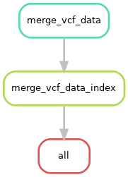

.. _tutorial/merger:

==============================
Merge VCF Data
==============================

.. hyperlinks
.. _Iliad: https://iliad.readthedocs.io/en/latest/index.html
.. _Snakemake: https://snakemake.readthedocs.io
.. _GCP: https://cloud.google.com/
.. _installation: https://iliad.readthedocs.io/en/latest/getting_started/installation.html
.. _slides: https://slides.com/johanneskoester/snakemake-tutorial
.. _liftover: https://iliad.readthedocs.io/en/latest/tutorial/liftover.html
.. _module: https://iliad.readthedocs.io/en/latest/tutorial/raw_sequence.html

TL;DR setup
===========
************

**SKIP STEP 2** Installation_ of Iliad. Singularity is not needed.

**Please make sure that your conda environment for Iliad is activated** - ``conda activate iliadEnv`` or ``mamba activate iliadEnv``

**Modify the configuration file** ``workdirPath`` parameter to the appropriate path leading up to and including ``/Iliad`` and a final forward slash e.g. ``/Path/To/Iliad/``. 
The configuration file is found in ``config/config.yaml``.

.. code-block:: yaml

    #####################################
    #####################################
    #####################################

    #  #  # USER INPUT VARIABLES  #  #  #

    #####################################
    #####################################
    #####################################

    # You must insert your /PATH/TO/Iliad/
    # use 'pwd' command to find your current working directory when you are inside of Iliad directory
    # e.g. /path/to/Iliad/ <---- must include forward slash at the end of working directory path

    # must include forward slash, '/', at the end of working directory path
    workdirPath: /Insert/path/to/Iliad/

You might consider changing some other parameters to your project needs that are pre-set and include:

* Merger submodule variables
.. code:: yaml

   MergerSubmodule:
      ProjectName: NEED MERGER PROJECT NAME HERE

Place your data into the ``/Iliad/data/vcf_merge/`` directory.

Since this module is NOT the main snakefile, Snakemake will NOT automatically detect it without the ``--snakefile`` flag. 
(Please make sure that your conda environment for Iliad is activated - ``conda activate iliadEnv`` or ``mamba activate iliadEnv``)

.. code-block:: console

    $ snakemake --snakefile workflow/mergerSub_Snakefile --cores 1

and combined with other user-specified snakemake flags such as ``--cores``.

If you plan to use on a local machine or self-built server without a job scheduler the default command to run is the following:

.. code-block:: console

   $ snakemake -p --use-conda --snakefile workflow/mergerSub_Snakefile --cores 1 --jobs 1 --default-resource=mem_mb=10000 --latency-wait 120

However, there is a file included in the ``Iliad`` directory named - ``mergerSub-snakemake.sh`` that will be useful in batch job submission. 
Below is an example snakemake workflow submission in SLURM job scheduler. 
Please read the shell variables at the top of the script and customize to your own paths and resource needs.

.. code-block:: console

   $ sbatch mergerSub-snakemake.sh

If you would like more in-depth information and descriptions, please continue to the next sections below. 
Otherwise, you have completed the TL;DR setup section.

Information
===========
************

This tutorial introduces the basic Bcftools merge `submodule` of the Iliad_ workflow developed using Snakemake workflow language.
Please visit Snakemake_ for specific details. They also provide informational slides_. In general, though, each module is composed of rules. These rules define how output files are generated from input files while 
automatically determining dependencies amongst the rules. A ``DAG`` (directed acyclic graph) of jobs will be built each time to account for all of the samples and jobs 
that will executed either via job scheduler or local cores and will execute in parallel if multiple jobs are declared.
Because of the Snakemake workflow system design, the **Iliad** workflow is scalable from single core machines to HPC clusters with job schedulers.

The **Merger submodule** is designed to simplify merging VCF where conda environments are created on the fly that contain BCFtools (v1.14) and there is no need for Singlurity.
We ensured no bioinformatics knowledge is needed to run this module with the help of internal test runs on MacOS, Windows, and HPC 
as well as external test runs performed on Google Cloud Platform (GCP_).

**Merger Submodule Rulegraph**

.. toctree::
   :maxdepth: 2

Background
==========

Genetics research continues at an unprecedented speed and collaborations or newly published open-source datasets may introduce the need merge data.
To make a comprehensive genomic pipeline, we wanted to provide the means necessary for researchers to easily combine datasets. 
Sometimes you just need to switch the position sites in your VCF files so you can properly merge your data with others, and you may want to visit our liftover_
submodule if you think the data you would like to combine has different reference assembly positions.
Pull requests and collobarations are welcomed.

Basics
======

This is a minor submodule in terms of being lightweight and does not require many of the components that some of the other modules do.
This module does not require Singularity.

If you have multiple independent VCF files and need the means to combine them, this module is for you.

The indicated sample list in the file ``/Iliad/data/vcf_merge/vcf-list.txt`` will be automatically read by BCFtools when running the appropriate Snakefile described here.
Your ``vcf`` will have to be annotated and have correct rsID tags. 
*We are currently working to add more submodule features for independent VCF annotation without requiring the use of the main modules.*

Default workflow configurations can be found in your path to the configuration file: ``config/config.yaml``.

By adding a project name in the configuration file, differnt merge instances will be contained in the specified project name directory automatically created.

In-depth Setup
**************

For this module, you can **SKIP STEP 2** Installation_ of Iliad.
You will find your new working directory within the ``path/to/project-workdir/Iliad/`` folder.
Make sure your current working directory is in this cloned repo as stated in the installation.
ALSO, be sure your ``workdirPath: /path/to/project-workdir/Iliad/`` in the ``config/config.yaml`` is set accordingly and with a forward slash ``/`` at the end.

.. code-block:: console

   $ cd Iliad

In that working directory you will find there are a number of directories with files and code to run each of the module pipelines.

**FIRST**, there is a ``/Iliad/data/vcf_merge/`` directory with a ``readme.md`` file. You must place your sample list in the ``/Iliad/data/vcf_merge/vcf-list.txt`` file in the ``data/vcf_merge/`` folder.
This list should contain the full path to your ``.vcf.gz`` files that you would like to merge - one file per line. 
Place your data into the ``/Iliad/data/vcf_merge/`` directory for simplicity - but by providing full paths in the ``vcf-list.txt`` to data that is accessible in your system,
 you don't have to necessarily migrate your data. There will be an auto generated directory with ``/Iliad/data/vcf_merge/`` for your specifically configured project name 

.. list-table:: vcf-list.txt
   :widths: 25

   * - /Path/To/File1.vcf.gz
   * - /Path/To/File2.vcf.gz
   * - /Path/To/File3.vcf.gz

**SECOND**, there is a configuration file with some default parameters, however, you MUST at least change the ``workdirPath`` parameter to the appropriate 
path leading up to and including ``/Iliad/`` e.g. ``/path/to/project-workdir/Iliad/``. The configuration file is found in ``config/config.yaml``.

.. code:: python

    workdirPath: /my/example/directory/Iliad/

Some other parameters that are pre-set and you might consider changing to your project needs include:

* Merge project configuration information
.. code:: yaml

   MergerSubmodule:
      ProjectName: NEED MERGER PROJECT NAME HERE

**THIRD**,
each module pipeline has a specific ``Snakefile``.
Snakemake will automatically detect the main snakefile, which is named excatly as such and found in the ``workflow`` directory: ``workflow/Snakefile``.
Iliad reserves the main snakefile for the main module, specifically the raw sequence read data module_.
This means the user must specify which ``Snakefile`` will be invoked with 

.. code-block:: console

    $ snakemake --snakefile workflow/mergerSub_Snakefile

and combined with other user-specified snakemake flags, of course, like ``--cores``.

Users must invoke this snakefile e.g. ``workflow/mergerSub_Snakefile`` to perform the desired VCF data merge for this **MERGER SUBMODULE**.

If you plan to use on a local machine or self-built server without a job scheduler the default command to run is the following:

.. code-block:: console

   $ snakemake -p --use-conda --cores 1 --jobs 1 --snakefile workflow/mergerSub_Snakefile --default-resource=mem_mb=10000 --latency-wait 120

However, there is a file included in the ``Iliad`` directory named - ``mergerSub-snakemake.sh`` that will be useful in batch job submission. 
Below is an example snakemake workflow submission in SLURM job scheduler. 
Please read the shell variables at the top of the script and customize to your own paths and resource needs.

.. code-block:: console

   $ sbatch mergerSub-snakemake.sh
