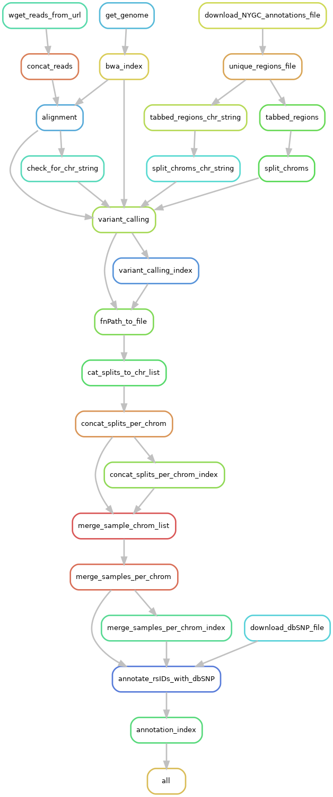

.. _tutorial/raw_sequence:

================================
Iliad Raw Sequence - Main Module
================================
##########################
.. hyperlinks
.. _Iliad: https://iliad.readthedocs.io/en/latest/index.html
.. _Snakemake: https://snakemake.readthedocs.io
.. _data: http://ftp.1000genomes.ebi.ac.uk/vol1/ftp/
.. _Odyssey: https://doi.org/10.1186/s12859-019-2964-5
.. _GCP: https://cloud.google.com/
.. _Bcftools: https://samtools.github.io/bcftools/bcftools.html
.. _installation: https://iliad.readthedocs.io/en/latest/getting_started/installation.html
.. _module: https://iliad.readthedocs.io/en/latest/tutorial/raw_sequence.html
.. _protocol: http://ftp.1000genomes.ebi.ac.uk/vol1/ftp/data_collections/1000G_2504_high_coverage/working/20190425_NYGC_GATK/1000G_README_2019April10_NYGCjointcalls.pdf
.. _chr22: http://ftp.1000genomes.ebi.ac.uk/vol1/ftp/data_collections/1000G_2504_high_coverage/working/20190425_NYGC_GATK/annotated/CCDG_13607_B01_GRM_WGS_2019-02-19_chr22.recalibrated_variants.annotated.txt
.. _vcf: https://ftp.ncbi.nih.gov/snp/organisms/human_9606_b151_GRCh38p7/VCF/
.. _slides: https://slides.com/johanneskoester/snakemake-tutorial

TL;DR setup
===========
************

.. list-table:: General Input and Output
   :align: center
   :widths: 25 25

   * - Input
     - Output
   * - FASTQ data or FTP links to FASTQ data
     - quality-controlled VCF for each chromosome

**Please make sure that your conda environment for Iliad is activated** - ``conda activate iliadEnv`` or ``mamba activate iliadEnv``

**Modify the configuration file** ``workdirPath`` parameter to the appropriate path leading up to and including ``/Iliad`` and a final forward slash e.g. ``/Path/To/Iliad/``. 
The configuration file is found in ``config/config.yaml``.

.. code-block:: yaml

    #####################################
    #####################################
    #####################################

    #  #  # USER INPUT VARIABLES  #  #  #

    #####################################
    #####################################
    #####################################

    # You must insert your /PATH/TO/Iliad/
    # use 'pwd' command to find your current working directory when you are inside of Iliad directory
    # e.g. /path/to/Iliad/ <---- must include forward slash at the end of working directory path

    # must include forward slash, '/', at the end of working directory path
    workdirPath: /Insert/path/to/Iliad/

You might consider changing some other parameters to your project needs that are pre-set and include:

* Homo sapiens GRCh38 release 104 reference genome

.. code:: yaml

    ref:
      species: homo_sapiens
      release: 104
      build: GRCh38

Use an Excel sheet or CSV file with no header and the following two columns/fields:

.. code-block:: console

    Sample   Unique sample identifier
    URL   raw sequence data download FTP link

Example: **UserSampleTable.xlsx** or **UserSampleTable.csv** are found in the ``/Iliad/config/`` directory

.. list-table:: UserSampleTable.xlsx
   :widths: 25 25

   * - KPGP-00127
     - ftp://ftp.kobic.re.kr/pub/KPGP/2020_release_candidate/WGS_SR/KPGP-00127/KPGP-00127_L1_R1.fq.gz
   * - KPGP-00127
     - ftp://ftp.kobic.re.kr/pub/KPGP/2020_release_candidate/WGS_SR/KPGP-00127/KPGP-00127_L1_R2.fq.gz

This exact template exists already in ``/Iliad/config/UserSampleTable.xlsx`` OR ``/Iliad/config/UserSampleTable.csv``. (The Excel Viewer extension on VS code is really handy for editing the .xlsx file if spreadsheets are your preference!)
If you already have the sequence files and are not downloading open-source data, you have the option to place your data into the ``Iliad/data/fastq/`` directory.

Whether you are automatically downloading via Iliad or you manually place data into ``Iliad/data/fastq/`` directory,
you need to provide a separate ``samples.tsv`` file where the TSV file has a header line with only one field named ``sample``.

.. code-block:: console

    sample  HEADER
    SAMPLE1 sample identifier
    SAMPLE2 sample identifier

Example: **samples.tsv** found in the ``/Iliad/config/`` directory

.. list-table:: samples.tsv
   :widths: 25

   * - sample
   * - KPGP-00127

since this module is the main snakefile, Snakemake will automatically detect it without the flag. 
(Please make sure that your conda environment for Iliad is activated - ``conda activate iliadEnv`` or ``mamba activate iliadEnv``)

.. code-block:: console

    $ snakemake --cores 1

and combined with other user-specified snakemake flags such as ``--cores``.

If you plan to use on a local machine or self-built server without a job scheduler the default command to run is the following:

.. code-block:: console

   $ snakemake -p --use-singularity --use-conda --cores 1 --jobs 1 --default-resource=mem_mb=10000 --latency-wait 120

However, there is a file included in the ``Iliad`` directory named - ``snakemake.sh`` that will be useful in batch job submission. 
Below is an example snakemake workflow submission in SLURM job scheduler. 
Please read the shell variables at the top of the script and customize to your own paths and resource needs.

.. code-block:: console

   $ sbatch snakemake.sh

If you would like more in-depth information and descriptions, please continue to the next sections below. 
Otherwise, you have completed the TL;DR setup section.

Information
===========
************

This How-To Guide introduces the raw sequence read data processing module of the Iliad_ workflow developed using Snakemake workflow language.
Please visit Snakemake_ for specific details. They also provide informational slides_. In general, though, each module is composed of rules. These rules define how output files are generated from input files while 
automatically determining dependencies amongst the rules. A ``DAG`` (directed acyclic graph) of jobs will be built each time to account for all the samples and jobs 
that will be executed either via a job scheduler or local cores and will execute in parallel if multiple jobs are declared.
Because of the Snakemake workflow system design, the **Iliad** workflow is scalable from single core machines to HPC clusters with job schedulers.

The **Raw Sequence Module** is designed to process FASTQ sequence files, whether they are single-end or paired-end reads.
Currently, it is most common to prepare **Reference Data** Panels from open-source Whole-Genome Sequence (WGS) data such as 1000 Genomes Project data_.
Reference data is paramount in preparation of target data samples, especially in human research studies where biogeographical ancestry is either the variable of interest 
or covariate, for instance in GWAS.
Depending on the level of data sharing, some research labs are unable to submit their target data to commercial imputation services and will need to build their own **Reference Data** Panel 
as well as depend on open-source Imputation tools. We highly recommend Odyssey_: `a semi-automated pipeline for phasing, imputation, and analysis of genome-wide genetic data`.

As sequence data gradually overtakes microarray data as the primary **Target Data** source, it is going to be mission critical 
to derive research related genotypic information quickly and efficiently from raw sequence data, too.
We ensured no bioinformatics knowledge is needed to run this module with the help of external test runs performed on Google Cloud Platform (GCP_).

**Raw Sequence Module Rule Graph**

.. toctree::
   :maxdepth: 2

Background
==========
************

Sequencing data is becoming more accessible for researchers. It's primary role for years in GWAS was to serve as reference data to fill in the gaps of 
target datasets containing large sample sizes through phasing and imputation techniques. This will continue to be a very important role as microarray data is 
still commonly used and more sequence data means bigger and better reference sets for this purpose. Sequence data's current role, however, is already in transition for 
its use as target data. The automation of the numerous steps to prepare data from a sequencer's raw output is crucial, so we developed `Iliad` with users of all levels 
in mind to obtain variant call files with clean and reliable genotypes. It does possess the capability to be adapted and have add-ons.
Pull requests and contributions are welcomed.

Basics
======
************

The raw files from a next-generation sequencer are FASTQ files found in ``.fastq`` or ``.fq`` format, and they are often zipped ``fastq.gz`` or ``fq.gz``.
There are instances where the data may be single-end reads or paired-end reads. In the case of **paired-end reads**, sample naming schemes can and will vary, 
but will have some form of ``Sample1_R1.fq.gz`` and ``Sample1_R2.fq.gz``. Paired-end reads are sequenced from both ends of the specified DNA read length.
`Iliad` raw sequence data module was designed to handle both types of sequence data but was tested using paired-end reads.
As the user, you have the choice to upload an Excel sheet or CSV file with no header and the following two columns/fields:

.. code-block:: console

    Sample   Unique sample identifier
    URL   raw sequence data download FTP link

If you already have the sequence files and are not downloading open-source data, you have the option to place your data into the ``Iliad/data/fastq/`` directory.
You will still need to provide a separate ``samples.tsv`` file in both situations where the TSV file has a header line with only one field named ``sample``.

.. code-block:: console

    sample  HEADER
    SAMPLE1 sample identifier
    SAMPLE2 sample identifier

These ``.fq.gz`` files will undergo multiplex concatenation if needed and sent to BWA mem alignment and sorting to create a sorted.bam file and it's index. 
This requires a reference genome assembly and Iliad downloads the user-configured reference genome fasta files. 
Iliad is configured to download *Homo sapiens* GRCh38 release 104 as default.

BCFtools_ is used to perform mpileup and call to perform variant calling on New York Genome Center (NYGC) annotated sites. `Iliad` downloads and uses the NYGC's 
annotated SNP regions file per chromosomes (link to chr22_ file) - `recalibrated_variants.annotated.txt`.
A README file can be found concerning the annotations protocol_.
These chromosome annotations files consume roughly 70 GB of storage, so we process the files into a simple regions file with two fields and no header: CHROM POS.
This reduces the file footprint to a little over 1 GB. The limitation of this file is `Homo sapiens` GRCh38 reference assembly.
There are 124,954,769 variants to be called across chromosomes 1-22 and X.

This is a resource intensive task to be performed on many samples and so we reduce the serial runtime by splitting each chromosome regions file into even splits 
that can be processed in parallel with job scheduling and management controlled by Snakemake. We can then concatenate the splits per chromosome per sample to obtain 23 
chromosome VCFs for each sample. Samples are merged at each chromosome and the ID field in the VCF is annotated using BCFtools and dbSNP annotations vcf_ so that 
each position is given a standardized ``rs ID``. The default configuration file is set to download human_9606_b151_GRCh38p7 ``All_20180418.vcf.gz``.

In-depth Setup
**************

Once the Installation_ of Iliad and its two dependencies has been completed, 
you will find your new working directory within the ``PATH/TO/Iliad`` folder.
Make sure your current working directory is in this cloned repo as stated in the installation.
If the repository is not cloned in that fashion, there is a chance that your directory will be improperly named as ``Iliad-main``. 

.. code-block:: console

   $ cd Iliad

In that working directory you will find there are a number of directories with files and code to run each of the module pipelines.

**FIRST**, 
there is a configuration file with some default parameters, however, you MUST at least change the ``workdirPath`` parameter to the appropriate 
path leading up to and including ``/Iliad`` e.g. ``/Path/To/Iliad/``. The configuration file is found in ``config/config.yaml``.

.. code:: python

    workdirPath: /Path/To/Iliad/

You might consider changing some other parameters to your project needs that are pre-set and include:

* Homo sapiens GRCh38 release 104 reference genome

.. code:: python

    ref:
      species: homo_sapiens
      release: 104
      build: GRCh38

* URL and path to FTP site housing the data for retrieval. Here is an example from 

.. code:: python

   url:
      # number of directories that the desired file is in at ftp site
      # for example
      # ftp://ftp.site.host.example/path/to/data/files/
      cutdirs: 5

**SECOND**, 
there is a ``data/fastq`` directory with a ``readme.md`` file. You must place all of your ``.fq.gz`` files in this folder **IF you have the files already**.
Otherwise, as mentioned above, `Iliad` features a downloading step, particularly from FTP sites where open-source genomic data is hosted.
You will need to provide a table of either Excel or CSV format as seen below. There is no header line so simply replace Sample with your unique identifier for your sample and 
URL for the specific URL path to the FTP site that hosts the data.

.. list-table:: UserSampleTable.xlsx or UserSampleTable.csv are found in the ``/Iliad/config/`` directory
   :widths: 25 25

   * - Sample
     - URL

You'll notice in provided templates, there are multiple rows of the same sample. Looking closely, you will find that these samples are multiplexed e.g. same samples, 
but sequenced multiple times on different lanes (L1, L2, etc.), and this is perfectly okay.

**THIRD**,
each module pipeline has a specific ``Snakefile``.
Snakemake will automatically detect the main snakefile, which is named excatly as such and found in the ``workflow`` directory: ``workflow/Snakefile``.
Iliad reserves the main snakefile for the main module, specifically this raw sequence read data module_.
This means the user must specify which ``Snakefile`` will be invoked with the following:

.. code-block:: console

    $ snakemake --snakefile workflow/Snakefile

**OR** since this module is the main snakefile, Snakemake will automatically detect it without the flag. 
(Please make sure that your conda environment for Iliad is activated - ``conda activate IliadEnv`` or ``mamba activate IliadEnv``)

.. code-block:: console

    $ snakemake --cores 1

and combined with other user-specified snakemake flags such as ``--cores``.

If you plan to use on a local machine or self-built server without a job scheduler the default command to run is the following:

.. code-block:: console

   $ snakemake -p --use-singularity --use-conda --cores 1 --jobs 1 --default-resource=mem_mb=10000 --latency-wait 120

However, there is a file included in the ``Iliad`` directory named - ``snakemake.sh`` that will be useful in batch job submission. 
Below is an example snakemake workflow submission in SLURM job scheduler. 
Please read the shell variables at the top of the script and customize to your own paths and resource needs.

.. code-block:: console

   $ sbatch snakemake.sh
